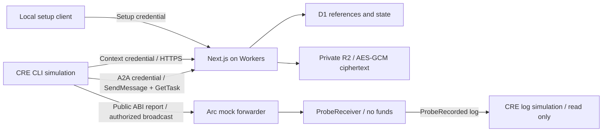

# Stage-one architecture

The workflow combines dispatch and evaluation for the bounded probe; it does not implement the later funded/submitted job lifecycle. `probeId` is not an escrow jobId.

The same synthetic portfolio result deliberately differs by one microunity under the `plus-one` fixture, selected only by the setup credential. Separate probes commit immutable policies with tolerance zero or one. The evaluation recalculates from input, verifies the persisted envelope commitment and produces decision 2 or 1 respectively.

D1 reserves each probe and task. R2 writes are conditional; retries adopt the saved object. Reserved tasks with a saved result recover their D1 ready state on the next SendMessage. The broader chain reconciler belongs to the later escrow stage.

The dedicated `./tee` transport export prevents the CRE runtime from leaking into the Next.js server bundle. No A2A server SDK is bundled into CRE. The generated receiver ABI is sourced from Foundry output; regenerate with `python3 scripts/generate-abi.py` after contract compilation.
